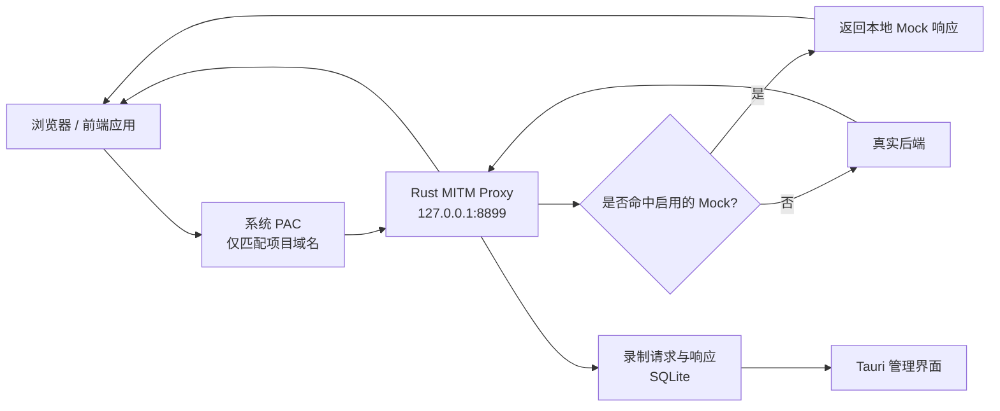

# Max Proxy Mock

> 面向前后端联调的本地 API 录制、Mock 与协议收敛桌面工具。

Max Proxy Mock 将指定 API 域名的 HTTP/HTTPS 流量导入本地代理：开发者可以录制真实接口、保存请求与响应、按项目管理接口，并把任意一次真实响应快速转换为可编辑的 Mock。目标不是只做一个“改包工具”，而是逐步成为前后端之间的接口协议工作台——当真实后端响应与约定的 Mock 契约一致时，界面可以明确标记接口已经完成接入。

当前主线是 **Rust + Tauri 2 桌面应用**；仓库中的 Go 服务是迁移期保留的旧实现，不再作为首选入口。

## 它解决什么问题

- 后端接口尚未完成时，前端仍可基于真实 URL 和可编辑响应继续开发。
- 不修改业务代码、不切换请求 SDK，通过系统 PAC 把指定域名导入本地代理。
- 录制浏览器实际请求，避免重复手写接口清单。
- 接口按项目隔离，并按 `project + path` 去重，重复请求会更新最后响应与命中次数。
- 将录制响应一键转为 Mock，实时修改 HTTP 状态码、Headers 与 Body。
- 为后续“Mock 契约与真实后端响应自动比较”保留统一的数据模型和产品入口。

> 当前版本已经支持录制与 Mock；“真实响应与 Mock 自动对比并标记 OK”属于下一阶段能力，尚未完成。详见 [开发路线](docs/roadmap.md)。

## 工作方式



可以直接打开 [流量代理动画](docs/traffic-proxy-animation.html)，切换“正常转发 / 录制 / Mock / 契约校验”场景观察完整链路。契约校验场景在动画中标记为规划能力。

## 当前能力

- 项目创建、选择、删除与域名配置。
- 对目标域名及其子域名生成 PAC 规则，其他流量保持直连。
- macOS 一键启用/恢复系统自动代理配置。
- 本地生成 CA，并提供 macOS 用户钥匙串安装与信任状态检测。
- HTTP/HTTPS MITM 代理与按域名选择性解密。
- 录制请求方法、Path、Headers、Body、响应状态、Body、Content-Type、耗时和命中次数。
- SSE 响应绕过 Body 录制，防止无限流被完整缓冲。
- 单次 Body 预览上限 2 MiB，超出后截断。
- 手动新增接口，以及从录制响应创建/编辑/启停 Mock。
- SQLite 本地持久化、WAL 模式和旧 Go 数据库自动迁移。
- 数据变化通过 Tauri Event 推送到 React 界面。

## 快速开始

### 环境要求

- macOS 12 或更高版本（当前一键 PAC 与证书安装仅实现 macOS）。
- Node.js 20.19+ 或 22.12+。
- Rust 1.86+。
- Xcode Command Line Tools。

### 开发运行

```bash
npm install
npm run tauri dev
```

也可以使用：

```bash
make desktop
```

如果 `8899` 或 `8900` 被本项目旧进程占用，启动脚本会安全关闭旧实例；如果端口属于其他程序，会停止并提示冲突进程。

### 构建 macOS 应用

```bash
npm run tauri build
```

Debug 构建：

```bash
npm run tauri build -- --debug
```

产物通常位于：

```text
src-tauri/target/release/bundle/macos/Max Proxy Mock.app
src-tauri/target/debug/bundle/macos/Max Proxy Mock.app
```

### 基础检查

```bash
make check
```

该命令执行 React/TypeScript 类型检查与 Rust `cargo check`。旧 Go 实现可单独执行 `make legacy-test`。

## 自动构建与发布

GitHub Actions 包含两条流水线：

- `CI`：push 到 `main` 或提交 Pull Request 时，检查 React/TypeScript、Rust 和旧 Go 测试。
- `Release desktop apps`：推送 `v*` 标签或在 Actions 页面手动触发时，创建 GitHub Release。

发布一个新版本前，先让 `src-tauri/tauri.conf.json` 与 `src-tauri/Cargo.toml` 的版本一致，然后执行：

```bash
git tag v0.2.0
git push origin v0.2.0
```

Release 会包含：

- macOS Apple Silicon（arm64）`.dmg`
- Windows x64 NSIS `-setup.exe`

当前自动构建产物尚未配置 Apple 公证和 Windows 代码签名，只适合开发测试。正式对外分发前应配置签名 Secrets，并增加签名、公证和安装回归步骤。

## 首次使用

1. 新建项目，填写 API 域名，例如 `api.example.com`，不要填写 Path。
2. 打开“代理设置助手”，启用 PAC。
3. HTTPS 域名需要安装并信任本地 CA；完成后完全退出并重新打开 Chrome。
4. 点击“开始录制”，刷新前端业务页面。
5. 在接口目录中选择已捕获接口，创建 Mock 并编辑返回内容。
6. 调试结束后，在代理设置助手中恢复原系统设置。

本地服务：

| 服务 | 地址 | 用途 |
| --- | --- | --- |
| MITM Proxy | `127.0.0.1:8899` | 接收 PAC 转入的 HTTP/HTTPS 流量 |
| PAC Server | `http://127.0.0.1:8900/proxy.pac` | 动态输出项目域名规则 |
| PAC Health | `http://127.0.0.1:8900/health` | 本地存活检查 |
| 管理 UI | Tauri WebView | 通过 Tauri IPC 调用 Rust 内核 |

## 数据与安全

桌面版数据默认保存到：

```text
~/Library/Application Support/dev.maxproxy.mock/
├── max-proxy-mock.db
└── certificates/
    ├── max-proxy-ca.crt
    └── max-proxy-ca.key
```

- 根证书私钥只应留在本机，绝不能上传、分享或提交到版本库。
- 只建议在开发/测试环境使用本工具，不要代理生产账号或高度敏感数据。
- PAC 仅转发项目配置的域名；本机地址、普通主机名和其他域名保持直连。
- 卸载应用前应先恢复系统代理，并在不再使用时从钥匙串移除本地 CA。
- 仓库根目录的 `data/` 属于旧 Go 版迁移数据，不是桌面版正式数据目录；交接或开源前必须清理其中的数据库和私钥。

## 项目结构

```text
max-proxy-mock/
├── web/                       # React 管理界面
│   └── src/
│       ├── App.tsx            # 页面状态、IPC API 适配、核心 UI
│       ├── components/        # Radix UI 封装组件
│       └── styles.css         # 桌面视觉系统
├── src-tauri/                 # 当前 Rust/Tauri 主线
│   ├── src/
│   │   ├── lib.rs             # 应用启动与服务编排
│   │   ├── proxy.rs           # MITM、录制与 Mock 命中
│   │   ├── pac.rs             # PAC HTTP 服务
│   │   ├── storage.rs         # SQLite 数据访问
│   │   ├── commands.rs        # Tauri IPC 命令路由
│   │   ├── system_proxy.rs    # macOS 系统代理管理
│   │   ├── certificate.rs     # CA 安装与信任检测
│   │   ├── core.rs            # 共享状态与事件
│   │   └── model.rs           # 领域模型
│   ├── vendor/hudsucker/      # 为项目固定的代理库源码
│   └── tauri.conf.json        # 窗口与打包配置
├── docs/                      # 架构、技术栈、路线图与接手指南
├── scripts/tauri.mjs          # 开发端口预检查与 Tauri CLI 包装
├── internal/ + main.go        # 旧 Go 实现，仅作迁移参考
└── Makefile                   # 常用开发命令
```

## 文档导航

- [文档索引](docs/README.md)
- [系统架构](docs/architecture.md)
- [技术栈与关键决策](docs/tech-stack.md)
- [开发路线](docs/roadmap.md)
- [AI/开发者接手指南](docs/ai-handoff.md)
- [流量代理动画](docs/traffic-proxy-animation.html)

## 当前边界

- 系统代理自动配置和证书自动安装目前只支持 macOS。
- Mock 命中后会直接短路返回，不会访问真实后端，因此当前无法同时完成后台比对。
- 去重键当前是 `project_id + path`，同 Path 的不同 Method 会被合并；这是需要优先修正的数据模型问题。
- 录制过程会缓冲普通请求/响应 Body，大文件虽然会截断存储预览，但转发前仍需要完整收集。
- WebSocket、压缩响应重写、GraphQL 操作级识别、OpenAPI 导入导出尚未完成。
- 当前 Rust 主线缺少自动化测试和数据库 schema 版本迁移机制。

## 参与开发

开始编码前请先阅读 [AI/开发者接手指南](docs/ai-handoff.md)，其中记录了当前真实状态、风险、推荐修改顺序和验收清单。任何涉及代理、证书、系统网络设置或数据库唯一键的变更，都应同时更新架构文档与路线图。
