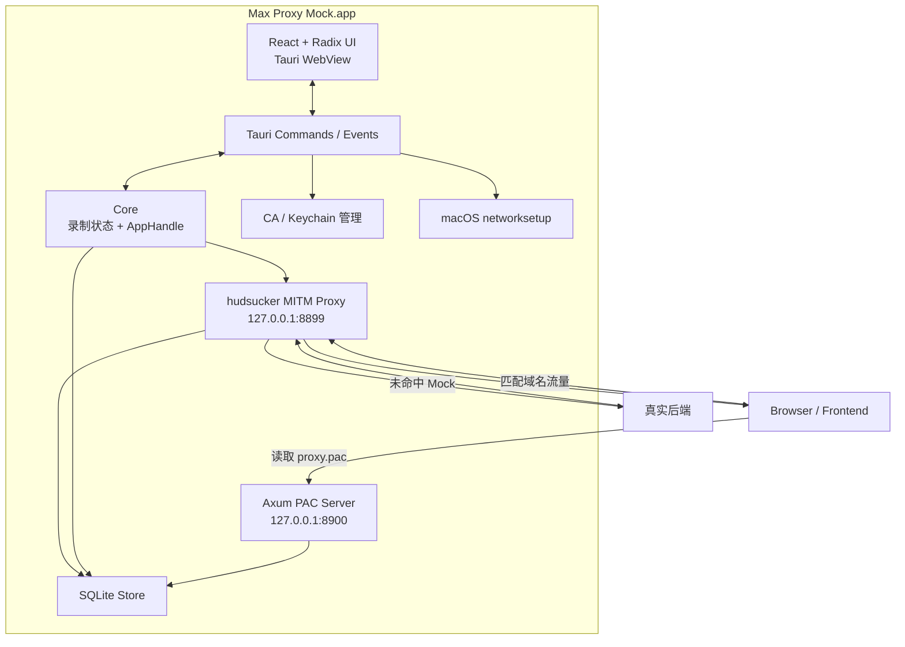
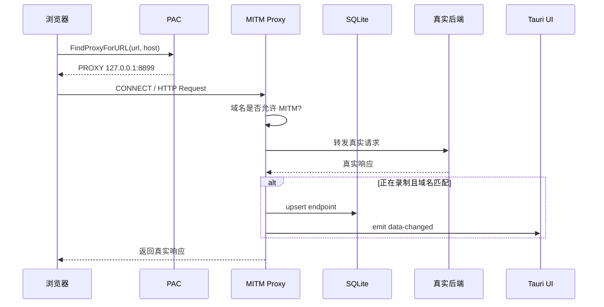
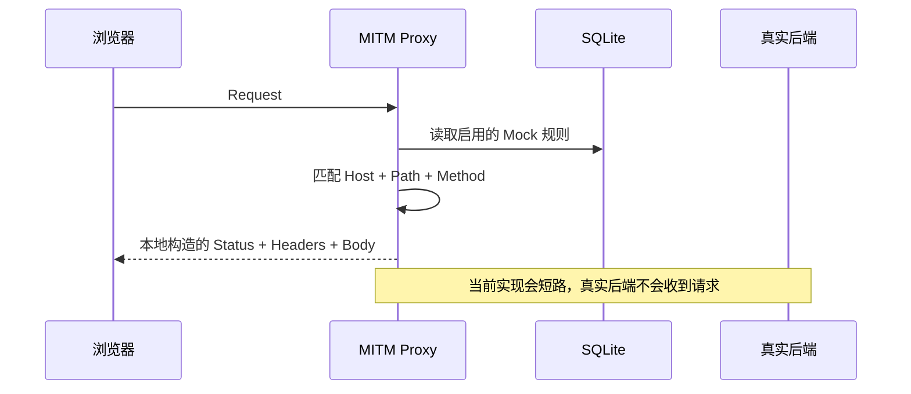
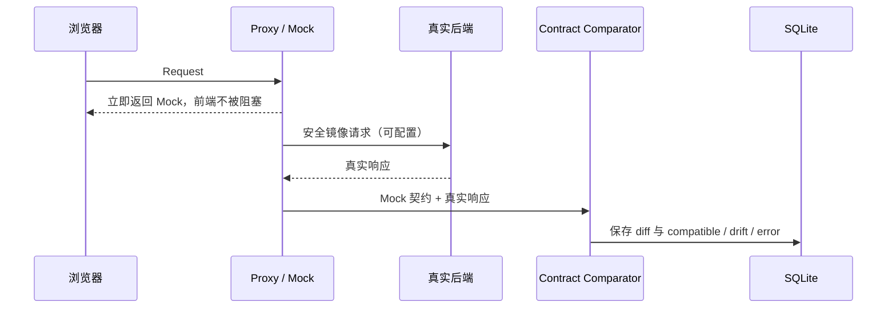

# 系统架构

## 1. 架构目标

Max Proxy Mock 采用“桌面壳 + 本地代理内核 + 本地持久化”的单机架构。业务流量不上传云端，管理 UI 不直接监听公网端口，所有核心能力都运行在用户电脑上。

设计原则：

- **透明接入**：业务代码继续请求原 API 域名，由 PAC 决定是否走代理。
- **最小代理范围**：只有项目中配置的域名及其子域名进入 `127.0.0.1:8899`。
- **本地优先**：接口、Mock、设置、CA 与私钥全部保存在本机。
- **录制与执行统一**：同一个代理既采集真实响应，也负责命中 Mock。
- **可演进为契约平台**：本地数据结构未来可同步到团队服务，但单机功能不依赖云端。

## 2. 运行时组件



### 组件职责

| 组件 | 代码位置 | 职责 |
| --- | --- | --- |
| Tauri 启动器 | `src-tauri/src/lib.rs` | 创建数据目录、打开数据库、迁移旧数据、启动代理/PAC、注册 IPC |
| Core | `src-tauri/src/core.rs` | 保存内存录制状态、为代理提供域名判定、向 UI 广播数据变化 |
| MITM Proxy | `src-tauri/src/proxy.rs` | TLS 拦截、Mock 匹配、请求/响应录制、真实后端转发 |
| PAC Server | `src-tauri/src/pac.rs` | 根据项目域名动态生成 PAC，提供 `/health` |
| Store | `src-tauri/src/storage.rs` | SQLite schema、CRUD、upsert 与旧数据库导入 |
| Commands | `src-tauri/src/commands.rs` | 把 UI 的类 REST 调用映射为本地 Rust 操作 |
| System Proxy | `src-tauri/src/system_proxy.rs` | 检测主网络服务、备份/启用/恢复 macOS PAC |
| Certificate | `src-tauri/src/certificate.rs` | 检查 CA 是否与钥匙串证书一致、验证 SSL 信任并安装证书 |
| React UI | `web/src/App.tsx` | 项目、录制、接口、Mock 与设置向导的交互状态 |

## 3. 流量时序

### 3.1 正常转发与录制



录制条件同时满足时才保存：

1. 录制状态 `active = true`。
2. 请求 Host 等于录制域名，或是该域名的子域名。
3. 响应不是 `text/event-stream`。

### 3.2 Mock 命中



代理返回 Mock 时会忽略存储的 `Content-Length` 和 `Content-Encoding`，避免修改 Body 后长度或编码失配；若规则未提供 `Content-Type`，默认使用 JSON UTF-8。

### 3.3 计划中的契约校验

目标行为不是让 Mock 阻断真实后端的成熟度判断，而是在保证前端稳定响应的同时，异步采集真实响应并比较：



该能力尚未实现。带副作用的方法不能默认镜像；建议第一版仅对 `GET/HEAD/OPTIONS` 开启自动验证，其他方法要求用户显式配置验证请求或只比较后续自然流量。

## 4. 域名与 TLS 决策

`normalize_domain` 会：

1. 去除首尾空白并转为小写。
2. 去除 `http://` 或 `https://`。
3. 去除 Path、端口和末尾点号。

`domain_matches(host, domain)` 接受精确域名和子域名，例如项目域名为 `example.com` 时，`api.example.com` 会匹配，但 `fakeexample.com` 不会匹配。

代理只对以下 Host 执行 MITM：

- 当前正在录制的域名；或
- 任意已保存项目的域名（用于让已启用 Mock 在没有录制时继续工作）。

HTTPS 流程依赖本地 CA。代理首次启动会在应用数据目录生成根证书和私钥，并为目标 Host 动态签发证书。浏览器只有信任该 CA 后才会接受代理连接。

## 5. 数据模型

### projects

| 字段 | 说明 |
| --- | --- |
| `id` | `prj_` 前缀 UUID |
| `name` | 项目名称 |
| `domain` | 规范化目标域名 |
| `created_at` | RFC 3339 UTC 时间 |

### endpoints

保存最后一次请求/响应快照和统计信息。当前唯一键是：

```text
UNIQUE(project_id, path)
```

这与产品期望的“接口”语义存在偏差：`GET /users` 与 `POST /users` 当前会覆盖为同一条记录。下一次 schema 迁移应调整为：

```text
UNIQUE(project_id, method, path)
```

### mock_rules

一个 endpoint 最多对应一个 Mock：`endpoint_id UNIQUE`。运行时匹配 `enabled + host + path + method`。

### app_settings

保存非敏感本地设置。当前用于备份启用 PAC 前的系统自动代理状态，以便恢复。

## 6. 状态与通信

- 项目、接口、Mock 和设置持久化在 SQLite。
- 录制状态保存在 `Core.recording` 的内存 `RwLock` 中，应用重启后恢复为停止。
- UI 使用统一 `api(path, init)` 适配层；桌面环境调用 Tauri `invoke("api_call")`。
- Rust 数据变化通过 `data-changed` event 通知 UI，UI 做防抖后重新拉取状态。
- `api_call` 使用类 REST 路径只是内部路由约定，并没有对外暴露管理 HTTP API。

## 7. 并发与性能边界

- Tokio 多线程运行时承载 Tauri、PAC 和代理任务。
- SQLite 使用一个 `Mutex<Connection>`，操作简单但会串行化数据库访问。
- 每次请求匹配 Mock 当前会从 SQLite 读取全部规则；规则量上升后应改为带版本号的内存索引。
- 普通 Body 通过 `collect()` 完整缓冲后再转发。`CAPTURE_LIMIT = 2 MiB` 只限制存储预览，不限制内存收集大小。
- SSE 不录制；WebSocket 和其他无限/升级流量需要专门测试。

## 8. 安全边界

高风险资产是本地 CA 私钥和被捕获的业务数据：

- 代理与 PAC 只监听 loopback。
- CA 私钥不应离开应用数据目录。
- UI 不应显示或导出敏感 Headers 的完整值，未来应默认遮蔽 `Authorization`、`Cookie`、`Set-Cookie`。
- 团队同步不能上传 CA 私钥；同步内容也应支持字段脱敏和项目级权限。
- 系统 PAC 修改前必须保存原状态，退出/崩溃恢复机制仍需加强。
- 契约校验若采用请求镜像，必须避免对有副作用接口造成二次写入。

## 9. 扩展点

- `CaptureHandler`：加入结构化 Diff、延迟/错误注入、脚本转换和 WebSocket 支持。
- `Store`：加入 schema migration、历史版本、环境维度和契约结果表。
- `Commands`：拆分为明确的 typed commands，减少字符串路由错误。
- `Core`：加入 Mock 内存索引、任务状态、日志与指标事件。
- `system_proxy`：抽象平台 adapter，支持 Windows/macOS，Linux 提供环境说明。
- 团队版：保留本地执行面，增加可选的控制面同步服务。
