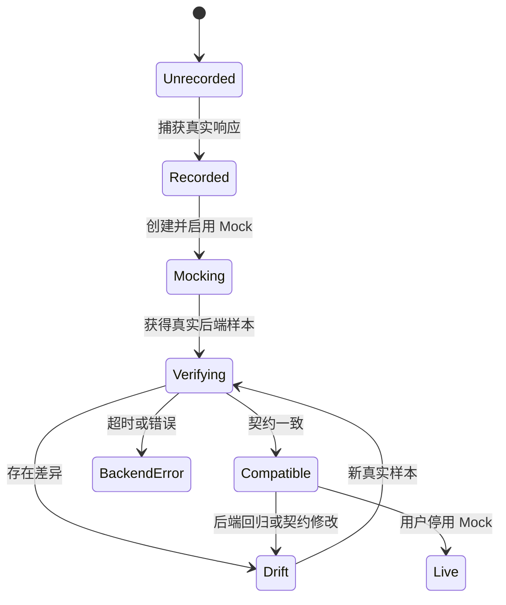

# 开发路线

## 产品北极星

Max Proxy Mock 的最终定位是“前后端协议收敛工作台”，而不仅是抓包器：

1. 前端基于可编辑 Mock 独立开发。
2. 后端逐步提供真实接口。
3. 工具持续比较 Mock 契约与真实响应。
4. 接口从 `Mocking` 进入 `Compatible`，团队可以安全移除 Mock。

## 当前状态：v0.2 本地桌面原型

### 已完成

- Rust + Tauri 2 桌面主线。
- React 深色桌面管理界面。
- 项目和目标域名管理。
- PAC 动态路由与 macOS 一键启用/恢复。
- HTTPS CA 生成、安装与信任状态检查。
- HTTP/HTTPS 真实流量录制。
- SQLite 本地持久化与旧 Go 数据导入。
- 录制结果转 Mock、状态码/Body 编辑与启停。
- 手动添加/删除接口。
- 按 Path upsert、记录命中次数与最后响应。

### 尚未完成

- Mock 与真实后端响应的自动结构化比较。
- 可观察的接口状态机和完成度统计。
- 数据库 schema migrations。
- Rust/前端主线自动化测试。
- Windows/Linux 系统集成。
- OpenAPI、环境、多域名、团队同步。

## Phase 0：安全与工程基线（必须优先）

目标：先让当前原型可持续修改，避免数据、证书或网络配置风险。

- [ ] 增加 `.gitignore`，排除 `data/*.db*`、证书私钥、`target/`、`web/dist/`。
- [ ] 清除任何准备提交或分享的真实数据库、CA 和私钥。
- [ ] 引入 SQLite schema version 与顺序 migrations。
- [ ] 把 endpoint 唯一键迁移为 `(project_id, method, path)`。
- [ ] 为 Rust 增加 domain matching、Mock matching、PAC、upsert migration 单元测试。
- [ ] 为 React 增加关键交互测试；至少覆盖项目、录制、Mock 编辑和错误反馈。
- [ ] 增加 CI：`npm ci`、TypeScript、Vite build、Cargo fmt/clippy/test/check。
- [ ] 应用退出时提示恢复 PAC；记录异常退出后的待恢复状态。
- [ ] 捕获数据默认脱敏 Authorization/Cookie/Set-Cookie 等敏感 Headers。

验收标准：新机器能按文档构建；测试稳定；升级 schema 不丢数据；仓库不包含私钥。

## Phase 1：协议收敛 MVP

目标：让用户直观看到“哪些接口后端已经接通”。

### 1.1 定义契约

- Mock 响应是当前期望契约的一个版本。
- 对 JSON 响应做 canonicalization：忽略对象键顺序，区分类型与缺失字段。
- 支持字段规则：忽略动态字段、可选字段、数组比较策略、状态码与 Header 规则。
- 保存契约版本，Mock 被编辑时产生新版本，而不是覆盖历史结论。

### 1.2 收集真实样本

- 安全方法 `GET/HEAD/OPTIONS`：可选开启后台 shadow request。
- 有副作用的方法：默认禁止镜像，只比较用户关闭 Mock 后产生的自然流量，或使用用户明确配置的验证请求。
- 增加超时、取消、请求头清洗和验证环境选择。

### 1.3 比较与状态

建议状态机：

- UI 显示字段级 Diff：missing / extra / type mismatch / value mismatch。
- 项目概览显示 Compatible、Drift、Unverified 数量。
- 允许用户确认“可接受差异”，形成明确规则，而不是静默忽略。

验收标准：一个 GET 接口启用 Mock 后，工具可以不影响前端响应地验证真实后端，并准确显示一致或差异。

## Phase 2：日常开发效率

- [ ] 项目支持多个域名与环境（dev/test/staging）。
- [ ] 请求列表、历史响应版本和时间线。
- [ ] Mock 延迟、超时、断网、状态码概率与场景切换。
- [ ] JSON/Headers 可视化编辑与 schema 校验。
- [ ] OpenAPI 3 导入/导出，生成初始接口与 Mock。
- [ ] cURL/HAR 导入；接口/Mock 批量导出。
- [ ] GraphQL operationName 级别去重和 Mock。
- [ ] 规则优先级、Path 参数和正则匹配。
- [ ] Mock 命中日志和调试原因说明。
- [ ] 托盘运行、代理状态提示和安全退出恢复。

## Phase 3：跨平台与可靠性

- [ ] Windows：系统代理/PAC、证书安装和卸载流程。
- [ ] macOS：签名、公证、自动更新和权限说明。
- [ ] Linux：GNOME/KDE 指引或 adapter，可选择环境变量模式。
- [ ] 流式录制，避免大型 Body 全量缓冲。
- [ ] 压缩内容透明解码/重编码。
- [ ] WebSocket、SSE 元数据与 gRPC-Web 支持策略。
- [ ] 代理崩溃隔离、结构化日志、诊断包和端口配置。

## Phase 4：团队合作版本

原则：**本地执行面不上传流量，云端/自建服务只做可选控制面。**

### 团队控制面

- 组织、成员、角色与项目权限。
- 契约、Mock 版本、Diff 规则与评审记录同步。
- 分支/环境、变更历史、评论和负责人。
- Webhook/CI 状态，PR 中展示协议变更。

### 本地执行面

- 保留代理、CA、真实业务响应和敏感数据在本机。
- 同步前执行字段脱敏与用户确认。
- 离线可用，网络恢复后进行版本冲突合并。
- 团队服务永不接收或分发 CA 私钥。

### CI/SDK

- Headless contract verifier。
- OpenAPI/JSON Schema 合规检查。
- PR 检查：breaking / compatible / unverified。
- 可选 CLI 导入、导出、启停场景。

## 建议里程碑

| 里程碑 | 核心结果 | 是否阻塞后续 |
| --- | --- | --- |
| M0 工程基线 | migrations、测试、脱敏、仓库安全 | 是 |
| M1 契约 MVP | GET Shadow + JSON Diff + 接口状态 | 是 |
| M2 开发效率 | 环境、历史、场景、OpenAPI | 否 |
| M3 发布质量 | 跨平台、签名更新、流式可靠性 | 团队版前建议完成 |
| M4 团队控制面 | 权限、同步、评审、CI | 最终方向 |

## 明确不做或谨慎做

- 不做生产流量代理或通用安全渗透工具。
- 不默认上传请求/响应到第三方服务。
- 不自动重放有副作用请求。
- 不以“完全相等”替代契约兼容判断。
- 不在没有恢复策略的情况下永久修改系统代理。
